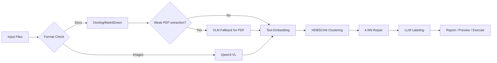

# D.I.T.E.

[](https://www.python.org/)
[](./LICENSE)
[](https://github.com/astral-sh/uv)
[](https://github.com/astral-sh/ruff)

English | **[简体中文](./README.zh-CN.md)**

> **D**ocument **I**nsight & **T**axonomy **E**ngine
> *"Silent observation, reconstructing order — an unsupervised learning-based multimodal document intelligent clustering engine."*

```text
YUKI.N> System initializing...
YUKI.N> Observations complete. Reconstructing local data structures.
```

**D.I.T.E.** is an autonomous file clustering entity. It is designed to handle chaotic document stacks that are difficult for humans to manually maintain, automatically organizing unstructured documents into logically coherent collections.

Unlike traditional tools, it requires no predefined labels and does not rely on manual human intervention. It silently "reads" every byte in your directory, extracts high-dimensional semantic features, and uses vector space clustering algorithms to reconstruct order from chaos.

## ✨ Core Capabilities

* 🔍 **Unsupervised Taxonomy**
Uses HDBSCAN algorithm to automatically discover intrinsic cluster structures in data, without requiring manually predefined categories.
* 🎯 **Multi-dimensional Perception**
Not only parses text, but also understands image content semantics through VLM (Vision Language Model), achieving true multimodal clustering.
* ⚡ **Incremental Processing**
Built-in SQLite state cache and hash-based deduplication mechanism ensures efficient processing of massive data while avoiding redundant computation.
* 🛡️ **Dry-Run Simulation**
Provides pre-execution simulation observation mode, generating detailed change predictions to ensure data reorganization safety.
* 📜 **Auditable Execution**
Supports generating Shell scripts instead of directly manipulating files, allowing users to perform code-level review before physical file moves.

## 🚀 Protocols

### Initialization

```bash
# Using uv (recommended)
git clone https://github.com/Kasugan0/dite.git
cd dite
uv sync

# First run will auto-create ~/.config/dite/config.yaml
uv run dite --help
# Edit ~/.config/dite/config.yaml, enter your API key
# Important: api.base_url must point to the OpenAI-compatible `/v1` root
# Example: https://api.example.com/v1

# Optional but recommended for local PDF extraction
uv run dite setup docling-pdf

# (Optional) Install shell completion for Tab auto-completion
uv run dite --install-completion
```

### Operations

```bash
# [Scan Mode] Scan target sector and generate observation report
uv run dite scan ./my_documents --output report.json

# [Smoke Check] Verify whether final PDF extraction output is usable enough
uv run dite pdf-check ./my_documents

# [Simulation] Preview reorganization results (no physical changes)
uv run dite organize ./my_documents --dry-run

# [Script Gen] Generate reorganization script (recommended safe approach)
uv run dite organize ./my_documents --output-script organize.sh

# [Execute] Execute physical reorganization
uv run dite organize ./my_documents --execute
```

### Cache Control

```bash
# Check cache status
uv run dite cache status

# Reset all cache
uv run dite cache clear

# Clear VLM cache only (preserve document conversion results)
uv run dite cache clear-vlm
```

## 📖 Command Reference

### `dite scan`

Start observation process. Scan specified directory, extract features and build semantic index.

```bash
dite scan <folder> [--output report.json] [--no-cache] [--no-knn-repair] [-v] [-q] [--color]
```

| Parameter | Description |
| --- | --- |
| `--output`, `-o` | Observation report output path |
| `--no-cache` | Force ignore historical records, recompute |
| `--no-knn-repair` | Disable k-NN noise repair |
| `--verbose`, `-v` | Verbose output (debug info) |
| `--quiet`, `-q` | Quiet mode (errors only) |
| `--color` | Force enable color output (for preserving colors when redirecting to file) |

### `dite organize`

Start reorganization process. Map files to new physical paths based on semantic clusters.

```bash
dite organize <folder> [--target <output>] [--dry-run|--execute|--output-script] [-v] [-q] [--color]
```

| Parameter | Description |
| --- | --- |
| `--target`, `-t` | Target reorganization path (default: `./organized/`) |
| `--dry-run` | Output prediction results only |
| `--execute` | Execute physical move immediately |
| `--output-script` | Generate executable Shell migration script |
| `--no-cache` | Disable cache |
| `--no-knn-repair` | Disable k-NN noise repair |
| `--verbose`, `-v` | Verbose output |
| `--quiet`, `-q` | Quiet mode |
| `--color` | Force enable color output |

### `dite pdf-check`

Quickly check whether final PDF extraction outputs are usable enough, without
running embedding, clustering, or naming.

```bash
dite pdf-check <folder> [--no-cache] [--cached-vlm-only] [-v] [-q]
```

| Parameter | Description |
| --- | --- |
| `--no-cache` | Disable cache and rerun extraction |
| `--cached-vlm-only` | Use only existing VLM cache, never call the API |
| `--verbose`, `-v` | Show per-file extraction details |
| `--quiet`, `-q` | Quiet mode |

Notes:

- This is a smoke check, not a full-document completeness audit.
- When PDF fallback uses VLM, it samples only the first 10 pages.
- A passing result means the final extracted output cleared the usability
  threshold, not that the whole document was extracted completely.
- The pass/fail threshold is `processing.vlm_fallback_threshold`.
- The 10-page VLM sampling limit is fixed in the current design and is not a
  user-facing config option.

## ⚙️ Configuration

**D.I.T.E.** always loads config from:

`~/.config/dite/config.yaml`

If the directory or file does not exist, D.I.T.E. creates it automatically with default values on first run.

`api.base_url` must be the OpenAI-compatible API root including `/v1`.
For example: `https://api.example.com/v1`

See [`dite.yaml.example`](./dite.yaml.example) for complete parameter definitions.

For extraction-related behavior:

- `processing.vlm_fallback_threshold` is the usability threshold used by
  `pdf-check`.
- `pdf-check` evaluates final extraction usability, not full-document
  completeness.
- PDF VLM fallback samples only the first 10 pages, and that sampling limit is
  currently fixed rather than configurable.

### Language Configuration

**D.I.T.E.** defaults to English output and also supports Chinese. Configure in `~/.config/dite/config.yaml`:

```yaml
i18n:
  locale: zh-CN  # or en (default)
```

## 🏗️ Architecture

System logic flow:



## 📁 Supported Formats

| Class | Extensions |
| --- | --- |
| **Document** | PDF, DOCX, DOC, PPTX, PPT, XLSX, XLS, MD, MARKDOWN, TXT, RTF |
| **Image** | JPG, JPEG, PNG, WebP, GIF |

## 🧬 Origin & Interface

### 📜 Initialization Log

The core code of this project originated from the "Infinite Document Pileup Incident" that broke out in a certain XCPC community called "Vegetable Garden".

The community leader **Devil Sis** observed a large-scale entropy increase phenomenon of unstructured data in her domain, causing the retrieval system to malfunction. To resolve this anomaly, she sent a development commission to another dimension.

### Project D.I.T.E.

>  **D**ocument **I**nsight & **T**axonomy **E**ngine
>
> a.k.a. **D**ata **I**ntegration **T**hought **E**ntity

This project name pays tribute to "The Melancholy of Haruhi Suzumiya". Just as the entities in the original work can rapidly parse universe-level information streams, this tool is designed to handle chaotic document stacks that are difficult for humans to manually maintain. We are not just organizing files, but reconstructing logic and order from chaotic data.

### System Persona: Nagato Yuki

**Yuki** is **D.I.T.E.**'s humanoid interface, responsible for executing specific observation and classification tasks.

* **Operational Logic**: Absolute rationality. Acts only based on confidence scores, providing no ambiguous feedback.
* **Visual Metaphor**:
  * **Oversized Coat**: Symbolizes the massive and complex deep learning model architecture underneath.
  * **Glasses**: Symbolizes the high-precision semantic parsing filter.

* **Interaction Mode**:
  * **Low Verbose**: Silent operation, only outputs logs when task completes or exceptions occur.
  * **Observer**: As a pure observer, does not modify file contents, only changes their spatial location (path).

```text
YUKI.N> Detected "Infinite Document Pileup Incident" in Sector [Vegetable-Garden].
YUKI.N> Incoming request from Administrator.
YUKI.N> Authorization verified. Counter-measure protocols engaged.
YUKI.N> Syncing local data structures...
```

<details>
<summary>🔮 Override Command</summary>

```text
YUKI.N> ただのフォルダには興味ありません。
YUKI.N> この中に、混沌としたドキュメントライブラリ、整理が必要な資料の山、
YUKI.N> あるいはフォーマットが混在するデータセットがあったら、私のところに来なさい。
YUKI.N> 以上。
```

</details>
