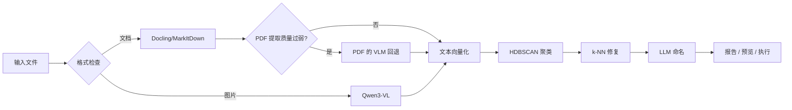

# D.I.T.E.

[](https://www.python.org/)
[](./LICENSE)
[](https://github.com/astral-sh/uv)
[](https://github.com/astral-sh/ruff)

**[English](./README.md)** | 简体中文

> **D**ocument **I**nsight & **T**axonomy **E**ngine
> _「静默观测，重构秩序——基于无监督学习的多模态文档智能聚类引擎。」_

```text
YUKI.N> System initializing...
YUKI.N> Observations complete. Reconstructing local data structures.
```

**D.I.T.E.** 是一个自律型文件聚类实体。它旨在处理人类难以手动维护的混沌文档堆栈，将无序的文档自动归纳为逻辑严密的集合。

不同于传统工具，它不需要预先定义的标签，也不依赖人类的手动干涉。它静默地「阅读」目录中的每一个字节，提取高维语义特征，利用向量空间的聚类算法，在混乱中重构秩序。

## ✨ 核心能力

- 🔍 **无监督分类**
  使用 HDBSCAN 算法自动发现数据内在的簇结构，无需人工预设类别。
- 🎯 **多维感知**
  不仅能解析文本，更能通过 VLM（视觉语言模型）理解图像内容的语义，实现真正的多模态聚类。
- ⚡ **增量处理**
  内置 SQLite 状态缓存与哈希去重机制，确保对海量数据的处理效率，避免重复计算。
- 🛡️ **安全模拟**
  提供执行前的模拟观测模式，生成详细的变更预测，确保数据重组的安全性。
- 📜 **可审计执行**
  支持生成 Shell 脚本而非直接操作文件，允许用户在执行物理移动前进行代码级审查。

## 🚀 快速开始

### 安装

```bash
# 使用 uv（推荐）
git clone https://github.com/Kasugan0/dite.git
cd dite
uv sync

# 第一次运行会自动创建 ~/.config/dite/config.yaml
uv run dite --help
# 编辑 ~/.config/dite/config.yaml，填入你的 API Key
# 重要：api.base_url 必须指向带 `/v1` 的 OpenAI 兼容接口根路径
# 例如：https://api.example.com/v1

# 可选但推荐：安装本地 PDF 提取所需的 Docling 模型
uv run dite setup docling-pdf

# （可选）安装 shell 补全，支持 Tab 键自动补全
uv run dite --install-completion
```

### 基本操作

```bash
# 扫描目标目录并生成观测报告
uv run dite scan ./my_documents --output report.json

# 预览重构结果（不产生物理变更）
uv run dite organize ./my_documents --dry-run

# 生成重构脚本（推荐安全做法）
uv run dite organize ./my_documents --output-script organize.sh

# 执行物理重构
uv run dite organize ./my_documents --execute
```

### 缓存控制

```bash
# 检查缓存状态
uv run dite cache status

# 重置所有缓存
uv run dite cache clear

# 仅清除 VLM 缓存（保留文档转换结果）
uv run dite cache clear-vlm
```

## 📖 命令参考

### `dite scan`

启动观测进程。扫描指定目录，提取特征并建立语义索引。

```bash
dite scan <folder> [--output report.json] [--no-cache] [--no-knn-repair] [-v] [-q] [--color]
```

| 参数              | 描述                                           |
| ----------------- | ---------------------------------------------- |
| `--output`, `-o`  | 观测报告输出路径                               |
| `--no-cache`      | 强制忽略历史记录，重新计算                     |
| `--no-knn-repair` | 禁用 k-NN 噪音修复                             |
| `--verbose`, `-v` | 详细输出（调试信息）                           |
| `--quiet`, `-q`   | 静默模式（仅错误）                             |
| `--color`         | 强制启用颜色输出（用于重定向到文件时保留颜色） |

### `dite organize`

启动重构进程。基于语义簇将文件映射到新的物理路径。

```bash
dite organize <folder> [--target <output>] [--dry-run|--execute|--output-script] [-v] [-q] [--color]
```

| 参数              | 描述                                  |
| ----------------- | ------------------------------------- |
| `--target`, `-t`  | 目标重构路径（默认为 `./organized/`） |
| `--dry-run`       | 仅输出预测结果                        |
| `--execute`       | 立即执行物理移动                      |
| `--output-script` | 生成可执行的 Shell 迁移脚本           |
| `--no-cache`      | 禁用缓存                              |
| `--no-knn-repair` | 禁用 k-NN 噪音修复                    |
| `--verbose`, `-v` | 详细输出                              |
| `--quiet`, `-q`   | 静默模式                              |
| `--color`         | 强制启用颜色输出                      |

## ⚙️ 配置

**D.I.T.E.** 永远只使用以下配置文件：

`~/.config/dite/config.yaml`

如果目录或文件不存在，首次运行会自动创建默认配置。

`api.base_url` 必须填写为包含 `/v1` 的 OpenAI 兼容 API 根路径。
例如：`https://api.example.com/v1`

完整参数定义请参阅 [`dite.yaml.example`](./dite.yaml.example)。

### 语言配置

**D.I.T.E.** 默认使用英文输出，同时支持中文。在 `~/.config/dite/config.yaml` 中配置：

```yaml
i18n:
  locale: zh-CN  # 或 en（默认）
```

## 🏗️ 架构

系统逻辑流如下：



## 📁 支持的格式

| 类别     | 扩展名                                             |
| -------- | -------------------------------------------------- |
| **文档** | PDF, DOCX, DOC, PPTX, PPT, XLSX, XLS, MD, MARKDOWN, TXT, RTF |
| **图片** | JPG, JPEG, PNG, WEBP, GIF                          |

## 🧬 起源

### 📜 初始化日志

本项目的核心代码构建契机，源于某 XCPC 社群「菜菜园子」所爆发的「无限文档堆积异变」。

社群领袖**恶魔妹妹**因其领域内观测到大规模非结构化数据的熵增现象，导致检索系统机能瘫痪。为了解决这一异变，她向异界发出了开发委托。

### 项目 D.I.T.E.

> **D**ocument **I**nsight & **T**axonomy **E**ngine
>
> 又名 **D**ata **I**ntegration **T**hought **E**ntity（资讯统合思念体）

本项目名称致敬《凉宫春日的忧郁》。正如原作中的存在能够高速解析宇宙级的资讯洪流，本工具旨在处理人类难以手动维护的混沌文档堆栈。我们不仅仅是整理文件，更是在混乱的数据中重构逻辑与秩序。

### 系统人格：长门有希

**Yuki** 是 **D.I.T.E.** 的拟人化交互界面，负责执行具体的观测与分类任务。

- **运行逻辑**：绝对理性。仅根据置信度行事，不提供模棱两可的反馈。
- **视觉隐喻**：

  - **不合身的大衣**：象征底层庞大而复杂的深度学习模型架构。
  - **眼镜**：象征高精度的语义解析过滤器。

- **交互模式**：
  - **低输出**：静默运行，仅在任务完成或发生异常时输出日志。
  - **观测者**：作为纯粹的观测者，不修改文件内容，仅改变其空间位置（路径）。

```text
YUKI.N> Detected "Infinite Document Pileup Incident" in Sector [Vegetable-Garden].
YUKI.N> Incoming request from Administrator.
YUKI.N> Authorization verified. Counter-measure protocols engaged.
YUKI.N> Syncing local data structures...
```

<details>
<summary>🔮 覆写指令</summary>

```text
YUKI.N> ただのフォルダには興味ありません。
YUKI.N> この中に、混沌としたドキュメントライブラリ、整理が必要な資料の山、
YUKI.N> あるいはフォーマットが混在するデータセットがあったら、私のところに来なさい。
YUKI.N> 以上。
```

</details>
